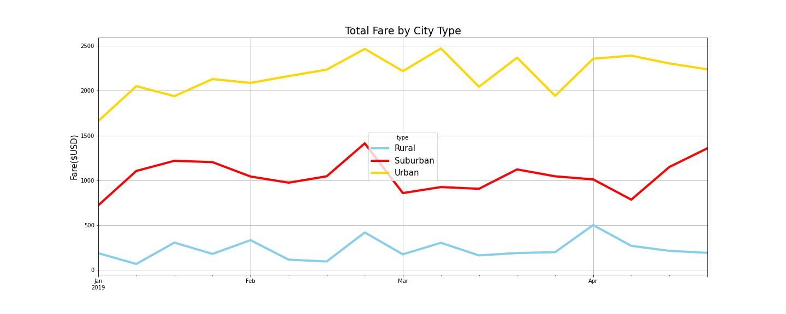

# PyBer Analysis
## Overview:
A summary of the ride-sharing data by city type is compiled using pandas. Then a multiple-line graph that shows the total weekly fares for each city type was plotted using pandas and matplotlib. V. Isualize would like us to analyze both summary and the graph to see how the data differs by city type and how those differences can be utilized by executives at PyBer.

## Result:
1. From the below DataFrame, we can summarize that Urban type has the most total number of rides(1,625), drivers(59,602) and fares($39,854) while Rural has the least number of riders(125), drivers(537) and fares($4327.93). Urban area has the most demands in general. In addition, there more total drivers a city type has, the less its average fare per ride and its average fare per driver; this may due to more competitions or less kilometer per ride in urban area. 

 
2. From the below line graph, we can conclde that most revenue came from urban area and the least from rural area. Also, end of Feburary looks like the fairly popular season for all 3 city types; both urban and suburban area has the most fare in end of Feb while rural area has the most fare in April. 

## Summary
Since there are disparities among the city types, it is a good oppotunity to utilize it in order to maximize company's profit:
1. Come up with more promotions or incentives for our clients during the off seasons.
2. Since there are less demands for everyday transit by people in rural area, we can look into cargo service or special ride to take people from urban area to farms or some tourist sites in rural area.
3. Most demands occur in urban area; however, the average fare is also the lowest. We can increase the average fare by a minimal amoumt by improving our service like providing snaks, bottles of watter or entertainment systems like karaoke so people won't mind paying more for the extra service. Not to mention, this can distinuish ourselves from our competitors.
